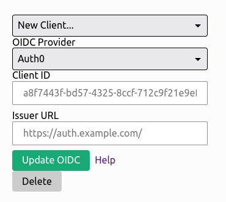
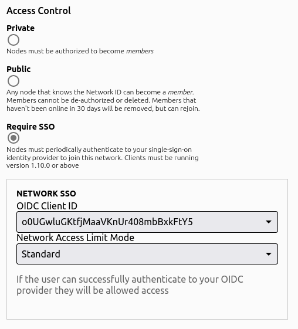
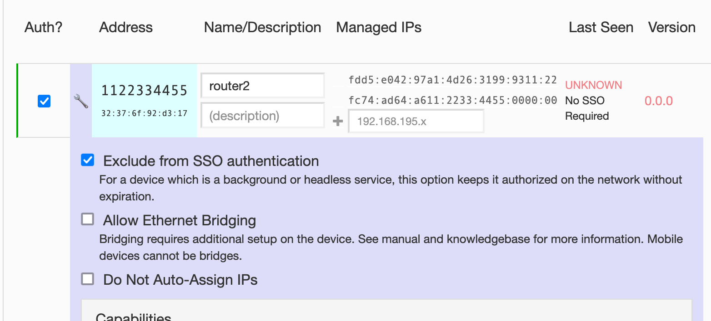
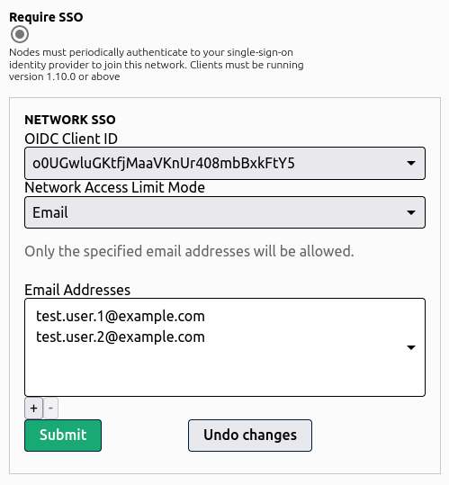
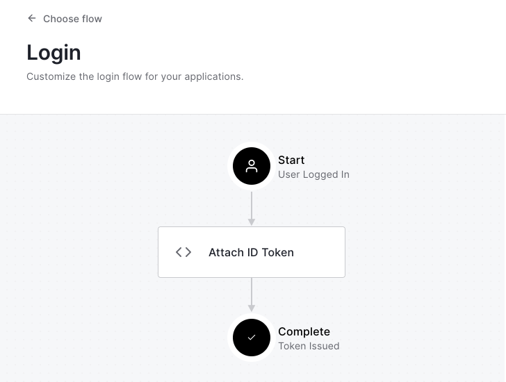
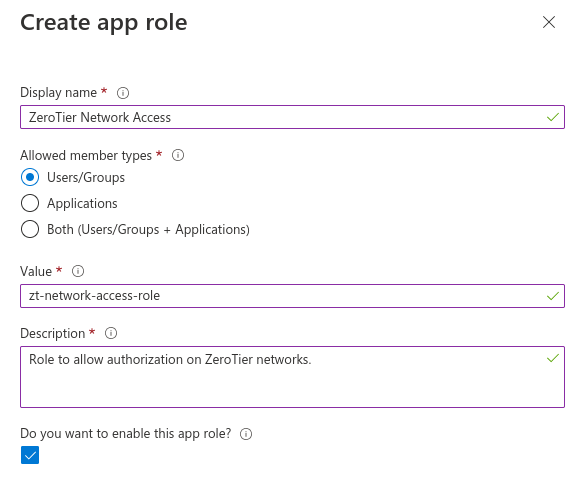

:::note
Device SSO is a paid feature available to Essential and Commercial subscribers. Details about what we charge for and how to manage your subscription are available on the [pricing](/pricing) guide.

For an overview of current pricing and terms including suggested use cases, please see the [Pricing](https://www.zerotier.com/pricing) page on our website.
:::

## ZeroTier Central configuration

:::info
SSO is currently only supported on desktop operating systems such as macOS and Windows.
:::

### Update clients

- Download and install ZeroTier 1.10.3 or greater on clients that will use SSO.

    <https://www.zerotier.com/download/>

### Configure SSO in ZeroTier Central

Visit <https://my.zerotier.com/account> and complete the SSO configuration toward the bottom of the page. You will need your sso provider's Issuer URL as well as a Client ID.



You can configure multiple OIDC clients for your organization, but only one may be used at a time on an individual network.

### Configure SSO on individual networks

If you enable this on an existing network, you may accidentally block existing users. Please practice on a test network.



There are three login modes for SSO enabled networks:

1. Standard - If the user can successfully authenticate to your OIDC provider, they will be allowed access to the ZeroTier network
2. [Email Based Access](sso#email-based-network-access) - The user is allowed to access the network if and only if their email address is in the email list provided by the network administrator.
3. [Group/Role Based Access](sso#role-based-network-access) - The user is allowed to access the network if and only if they are assigned one of the  proper roles by the OIDC server.

### Exclude specific devices from SSO requirements

This is useful for routers, servers, embedded devices, etc…
You can do this from the wrench icon in the Members list.



## SSO provider configuration

- SSO Provider **must** support [PKCE](https://oauth.net/2/pkce/)
- Requires the following scopes:
  - `openid`
  - `profile`
  - `email`
  - `offline_access`
- Configure the callback URL to `http://localhost:9993/sso`

## Provider Specific Configuration Notes

### Auth0 {#auth0-config}

Please ensure the following fields are set on your Auth0 application config:

- Application Type:  Native
- Token Endpoint Authentication Method: None
- Allowed Callback URL: <http://localhost:9993/sso>
- Under Advanced Settings -> Grant Types, ensure Authorization Code, and Refresh Token are selected.

:::note

The OIDC spec is picky about the Issuer URL you enter.  It must match what the server configuration metadata endpoint returns.

In the case of Auth0 specifically, Your Issuer URL *MUST* end with a `/`.  For example, in Auth0's application configuration, show's just the fully qualified domain name.  What must be entered in the Issuer field in ZeroTier Central is: `https://your-domain-id.auth0.com/`

:::

### Authelia

[Authelia](https://www.authelia.com/) is a self hosted SSO solution. ZeroTier uses PKCE, so the field `secret` must be an empty string and `public` must be true.

:::note

Use of Authelia requires ZeroTierOne version 1.10.1 or greater.  There is an incompatibility between the two in the 1.10.0 release.

:::

Example client configuration:

```yaml
    clients:
        ## The ID is the OpenID Connect ClientID which is used to link an application to a configuration.
      - id: authelia-sso-client

        ## The description to show to users when they end up on the consent screen. Defaults to the ID above.
        description: zerotier

        ## The client secret is a shared secret between Authelia and the consumer of this client.
        secret: ""

        ## Sector Identifiers are occasionally used to generate pairwise subject identifiers. In most cases this is not
        ## necessary. Read the documentation for more information.
        ## The subject identifier must be the host component of a URL, which is a domain name with an optional port.
        # sector_identifier: example.com

        ## Sets the client to public. This should typically not be set, please see the documentation for usage.
        public: true

        ## The policy to require for this client; one_factor or two_factor.
        authorization_policy: one_factor

        ## By default users cannot remember pre-configured consents. Setting this value to a period of time using a
        ## duration notation will enable users to remember consent for this client. The time configured is the amount
        ## of time the pre-configured consent is valid for granting new authorizations to the user.
        # pre_configured_consent_duration:

        ## Audience this client is allowed to request.
        audience: [
          "authelia-test-client"
        ]

        ## Scopes this client is allowed to request.
        scopes:
          - openid
          - groups
          - email
          - profile
          - offline_access

        ## Redirect URI's specifies a list of valid case-sensitive callbacks for this client.
        redirect_uris:
          - http://localhost:9993/sso

        ## Grant Types configures which grants this client can obtain.
        ## It's not recommended to define this unless you know what you're doing.
        grant_types:
          - refresh_token
          - authorization_code

        ## Response Types configures which responses this client can be sent.
        ## It's not recommended to define this unless you know what you're doing.
        response_types:
          - code
          - id_token

        ## Response Modes configures which response modes this client supports.
        response_modes:
          - form_post
          - query
          - fragment

        ## The algorithm used to sign userinfo endpoint responses for this client, either none or RS256.
        userinfo_signing_algorithm: none
```

### Azure AD {#azure-config}

Navigate to your directory in the Azure portal, and select "App Registrations" in the Manage column.

Click "New Registration"

Set the Name of the application. e.g. "ZeroTier Central SSO"

Under Redirect URI:

Platform: Public client/native (mobile & desktop)

Set the Redirect URI to `http://localhost:9993/sso`

#### Getting your AzureAD Issuer URL

Once your app registration is configured, open the "Endpoints" tab.  Look for "OpenID Connect Metadata Document".


The Issuer URL is everything up to `/.well-known/openid-configuration`.  For example `https://login.microsoftonline.com/00000000-0000-0000-0000-000000000000/v2.0`.  Do not use a trailing `/` when you enter the "issuer" url in Central.

### Google Workspace

Google OAuth2/OIDC is not supported as Google does not support PKCE clients at this time. You can, however, use [Keycloak as a SAML Identity Broker](http://localhost:3000/central/sso#keycloak-as-a-saml-identity-broker) with Google Workspace.

### Keycloak

Log into your Keycloak administration console, go to the Client configuration and create a new client. Configuration is fairly straightforward, with the following requirements:

- Client Protocol: openid-connect
- Access Type: public
- Standard Flow Enabled: ON
- Root URL: <https://my.zerotier.com>
- Valid Redirect URLS
  - <https://my.zerotier.com/>*
  - <http://localhost/sso>
- Admin URL: <https://my.zerotier.com>
- Web Origins: *

See [here](https://www.keycloak.org/docs/latest/server_admin/index.html#assembly-managing-clients_server_administration_guide) for full documentation for configuring OpenID Connect clients with Keycloak.

#### Keycloak as a SAML Identity Broker

If you have a SAML provider, but not an OpenID Connect provider, [Keycloak](https://www.keycloak.org) can also be used to bridge the gap. On your keycloak Admin page, go to Identity Providers. From the dropdown, select `SAML v2.0` and create the connection to your SAML provider. Combined with the general Keycloak OIDC client settings above, you now have an OIDC server that authenticates against your SAML provider.

### Okta {#okta-config}

- Application Type:  Native
- Token Endpoint Authentication Method: None
- Allowed Callback URL: <http://localhost:9993/sso>
- Under Advanced Settings -> Grant Types, ensure Implicit, Authorization Code, and Refresh Token are selected.

### OneLogin

:::note

OneLogin requires ZeroTier One v1.10.3+

:::

Log in to your OneLogin admin console.  Select "Custom Connectors" from the "Applications" menu.  Hit the "New Connector" button.  Name your connector, set Sign on method to OpenID Connect, and set the Redirect URI to `https://localhost:9993/sso`. Finally, back on the on Custom Connectors page, hit the "Add App to Connector" link. Adjust the description & logo settings as you see fit, and then save.

Once the above steps are complete, go to the SSO tab for your new OneLogin Application. Set "Application Type" to "Native", and "Token Endpoint" to "None (PKCE)".  You'll also find the required Client ID and Issuer URLs to enter into <https://my.zerotier.com/account>.

## Customizing the Final SSO Flow Page

If you wish, you can customize the final view of the sso login process.
Create the file `$ZEROTIER_HOME/sso-auth.template.html`.

Note: Any CSS or images must be hosted externally, or placed within the single HTML page itself.

You may customize the page to look however you wish. At this time there
are only two template values set by zerotier:

- `networkId`
- `messageText`

Templates must be valid HTML, and the template values must be placed inside `{{ ...  }}` blocks like so:

```text
{{ networkId }}
{{ messageText }}
```

You may react to errors via the `isError` variable:

```text

<span style="color: red;">{{ messageText }}</span>

{{ messageText }}

```

## Email Based Network Access

With Email based network access, a network administrator can limit access to the network to only users whose email addresses are present in the list specified by the network administrator.



## Role Based Network Access

Configuring Role Based Access controls is different across all of the different OIDC providers available.  We'll give examples for many of the large ones.

Role/group names are up to the network administrator.  Simply add one or more role name to your network configuration, and users will be required to have at least one of those roles assigned in order to access the network.

### Auth0 {#auth0-rbac}

Auth0 requires multiple steps to configure.

#### Step 1: Create a Role and Assign Users

Log into your auth0.com management console.  Go to User Management and select roles.  Hit the `+ Create Role` button in the upper right corner.  Give your new role a name & description of your choosing.


Once the new role is created, go to the Users tab.  There you will be able to add the users you wish to have access to the role.

#### Step 2: Attach Roles to ID and Access Tokens

In order for ZeroTier to be able to read the roles a user has been assigned, they must be added to the ID and Access tokens, and mapped to the correct name.  In the Auth0.com dashboard, go to Actions, and select Flows. Click the Login flow. On the right side of the screen, hit the + next to  `Add Action` and select `Build Custom`.  Give the action a name such as "Attach ZeroTier Roles" with Trigger set to "Login/Post Login" and Runtime set to "Node 16" (or whatever the latest default is).

Next you will get a screen with a code editor.  Delete everything in the buffer and add the following:

```js
exports.onExecutePostLogin = async (event, api) => {
    const namespace = "https://my.zerotier.com";
    if (event.authorization) {
        api.idToken.setCustomClaim(`${namespace}/roles`, event.authorization.roles);
        api.accessToken.setCustomClaim(`${namespace}/roles`, event.authorization.roles);
    }
}
```

:::note
Auth0 requires roles to be in a namespaced name. To properly integrate with ZeroTier Central, the final claim name set on the token via the script above **must** be `https://my.zerotier.com/roles`. Please enter the login script exactly as shown above to reduce the chances of errors.
:::

Once it is entered, hit `Deploy` on the upper right hand side of the screen.

Hit the `<- Back to flow` link, which will take you back to the Login Flow graph.  Under Add Action, select Custom.  You'll find your new action listed there.  Drag it between `Start` and `Complete` in the login flow and click Apply. When finished, your flow will look something like this:



Your users' assigned roles will now be attached to the tokens required to authorize a user on your ZeroTier networks.

### Azure AD {#azure-rbac}

<https://learn.microsoft.com/en-us/azure/active-directory/develop/howto-add-app-roles-in-azure-ad-apps>

### Step 1: Create an App Role

In the Azure portal, go to Azure Active Directory and select App Registrations. Select the app you've created for integration with ZeroTier Central.  In the Manage menu, select App Roles, and then create a new app role and hit Apply



The `Value` field is what you use as the role name in the network configuration on <https://my.zerotier.com>

### Step 2: Assign App Role

Go back to Azure Active Directory in the Azure portal. Select Enterprise Applications from the list of options on the side of the screen.  Select the app to be used for ZeroTier Central integration.

Select `Users and Groups` from the Manage menu. Select all of the users you want to assign the App Role and select `Edit Assignment`.  Click on the area of the screen that says "Select a Role", then find your newly created app role from step 1, click it and hit the `Select` button.

### Okta {#okta-rbac}

Okta doesn't have the concept of Roles, but it does have Groups that can be used for the same purpose when authenticating to a ZeroTier network.

:::note

Okta role/group based access requires ZeroTier One version 1.10.3+

:::

#### Step 1: Create a Group and Assign Users

From your Okta administrator dashboard, go to Directory and select Groups. Create a group with the name of your choice.  Once created, assign people to the group that you want to have access to your ZeroTier network.

#### Step 2: Attach Groups to Tokens

In the Okta administrator dashboard, go to Applications and open the configuration for the Okta Application you've configured for use with ZeroTier.  Click the 'Edit' button in the "OpenID Connect ID Token" box.  Set "Group claim type" to "Filter", and set the three fields for "Group claim filter" to `roles`, `Matches regex`, and `.*`.


It is possible to limit the groups to only certain groups.  See Okta's [group filter documentation](https://developer.okta.com/docs/reference/okta-expression-language/#group-functions) for more information.

### OneLogin by OneIdentity

Coming Soon
