import Tabs from '@theme/Tabs';
import TabItem from '@theme/TabItem';

A ZeroTier network is essentially a secure Local Area Network (LAN) that you can use anywhere in the world. Let's make one and connect two devices over ZeroTier.

We'll use `ping` to test the connection. Any two devices that can run ZeroTier will do: laptop, phone, virtual machine, etc…

Both devices can be at the same location, on the same physical network. If you move one to a cafe or to your office, it should still just work.

The rough outline is:

- Create a ZeroTier network
- Join the network from two devices
- `ping` one device from the other over the ZeroTier network

This should take about 5 minutes.

<details>
<summary>Results Preview</summary>
Here is a summary of the results of this tutorial, if you're a networking person.

If this doesn't mean anything to you, that's OK. We'll get there.

Each zerotier network you join creates a network interface on your device. It's like adding another Ethernet port to your computer.

```sh
node1# ip -o a
1: lo    inet 127.0.0.1/8 scope host lo\       valid_lft forever preferred_lft forever
2: eth0    inet 192.168.182.201/24 brd 192.168.182.255 scope global dynamic noprefixroute eth0\       valid_lft 3277sec preferred_lft 2827sec
9: zt3jn2z57r    inet 10.2.0.11/23 brd 10.2.1.255 scope global zt3jn2z57r\       valid_lft forever preferred_lft forever
```

```sh
node2# ip -o a
1: lo    inet 127.0.0.1/8 scope host lo\       valid_lft forever preferred_lft forever
2: eth0    inet 192.168.182.202/24 brd 192.168.182.255 scope global dynamic noprefixroute eth0\       valid_lft 3277sec preferred_lft 2827sec
9: zt3jn2z57r    inet 10.2.0.12/23 brd 10.2.1.255 scope global zt3jn2z57r\       valid_lft forever preferred_lft forever
```

```sh
node1# ping -c 3 10.2.0.12
PING 10.2.0.2 (10.2.0.12) 56(84) bytes of data.
64 bytes from 10.2.0.12: icmp_seq=1 ttl=64 time=5.66 ms
64 bytes from 10.2.0.12: icmp_seq=2 ttl=64 time=6.62 ms
64 bytes from 10.2.0.12: icmp_seq=3 ttl=64 time=8.50 ms

--- 10.2.0.12 ping statistics ---
3 packets transmitted, 3 received, 0% packet loss, time 2004ms
```

</details>

## Create your first ZeroTier network

### Create an account

:::note

It's free, no credit card is required.

:::

- Go to <a href="https://my.zerotier.com/" target="_blank">my.zerotier.com</a> and create an account.

### Create a network

- Make sure you're on the "Networks" tab of my.zerotier.com

- Click the __Create A Network__ button.

This creates a virtual network with a random ID and a random name. We got "fervent_smathers" and `d5e04297a16fa690` here.


- Click anywhere on the network to go to the details page for this network.

See the Network Settings panel:


We don't need to change any settings, but we can change the name of the network to personalize it.

- Change "fervent_smathers" to "my cool network" or whatever you like.

- Collapse the Settings panel. Click on the word "Settings" at the top of the panel.

You don't need to change any other settings.

- See the Network Members panel:

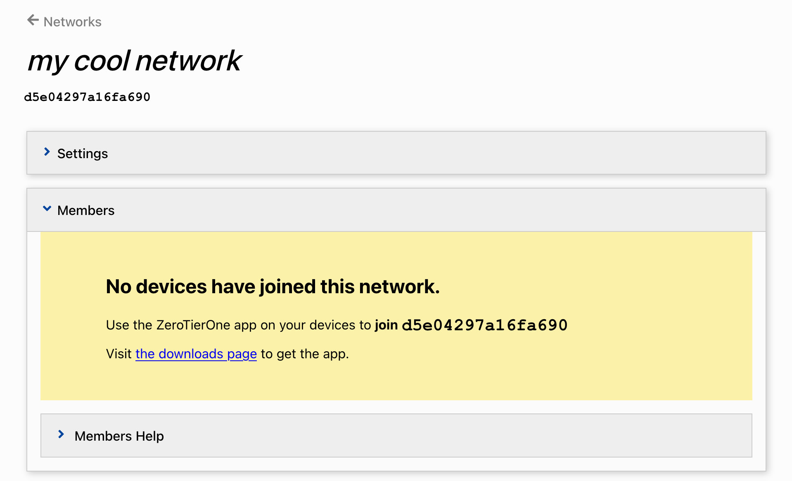

It should say "No devices have joined this network".

- Leave this browser tab open. We'll look at it again later.

## Setup the ZeroTier app

### Download and install ZeroTier

For mobile devices, use the app store.

- Go to <a href="https://www.zerotier.com/download" target="_blank">zerotier.com/download</a> in a different tab of your browser.
- Run the installer

The ZeroTier client should now running on your device.

### Join your first ZeroTier network

We need to tell the client to "join" the virtual network we just created.

- Copy the Network ID of the network from my.zerotier.com
This is the long number that looks like like: `d5e04297a16fa690`

- Paste the Network ID into the "join" command on your device

On macOS and Windows, there is a menubar/tray app. Select "join" from the menu.

<Tabs
  defaultValue="mac"
  groupId="client-join"
  values={[
    { label: "macOS", value: "mac", },
    { label: "Windows", value: "windows", },
    { label: "Command Line", value: "linux", },
    { label: "Mobile", value: "mobile", }
  ]}>

<TabItem value="mac">

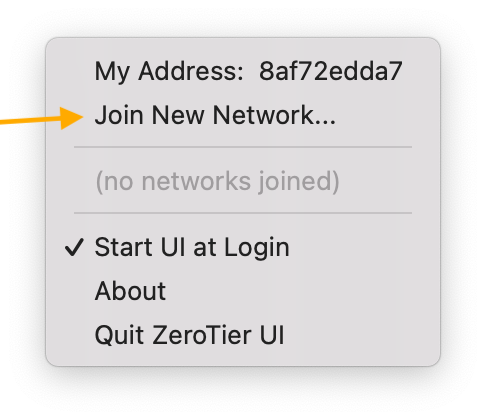
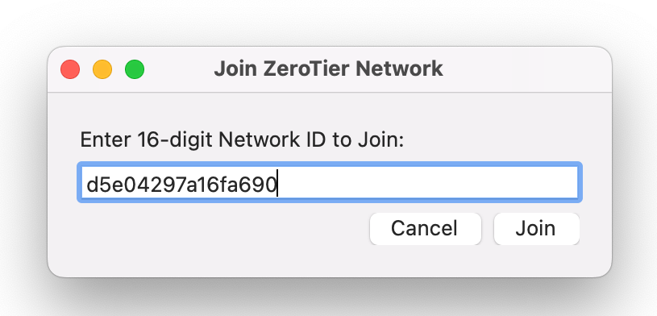

</TabItem>

<TabItem value="windows">

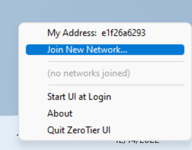
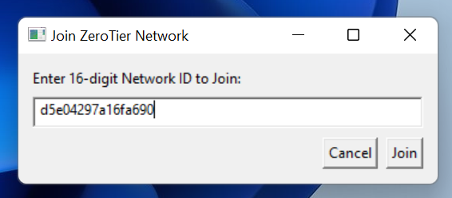

</TabItem>
<TabItem value="linux">
On linux, you need to be root, or use `sudo` in front of the commands
On macOS, `sudo` is not required.
On Windows, you need to use an Admin Prompt. Type "powershell" into the start menu, then right click and "Open as Admin"

```sh
% zerotier-cli info
200 info 8af72edda7 1.10.2 ONLINE

% zerotier-cli join d5e04297a16fa690
200 join OK
```

</TabItem>
<TabItem value="mobile">

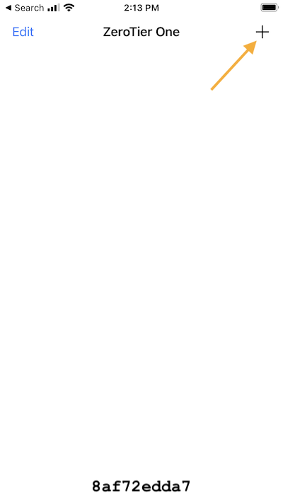
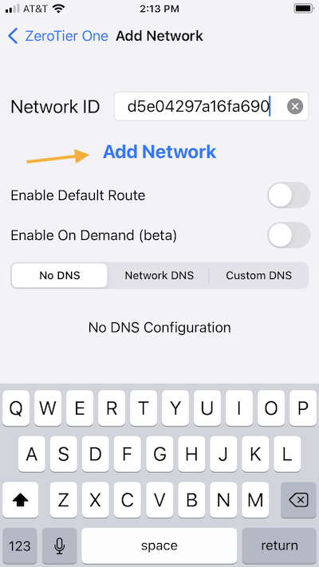

</TabItem>

</Tabs>

:::note

Every running instance of ZeroTier has a unique address. It's the 10 digit "Address" in the app, or `zerotier-cli info` command.

ZeroTier addresses are a very secure method of unique identification.

:::

## Authorize your device on your network

At this point, your client should say "Access Denied."
A device can't talk on your network unless you allow it, even if someone discovers the network's ID.

<Tabs
  defaultValue="mac"
  groupId="access-denied"
  values={[
    { label: "macOS", value: "mac", },
    { label: "Windows", value: "windows", },
    { label: "Linux", value: "linux", },
    { label: "Mobile", value: "mobile", }
  ]}>

<TabItem value="mac">

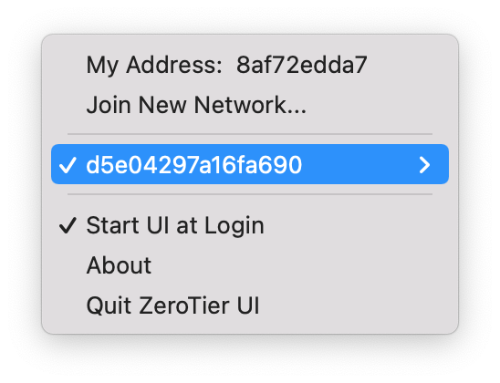
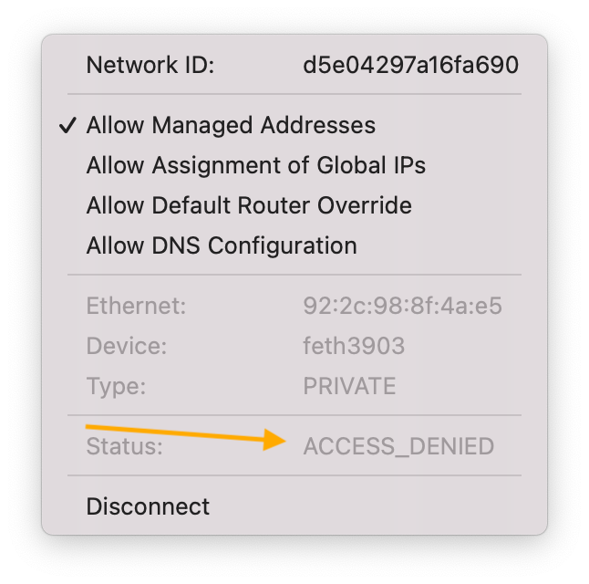

</TabItem>

<TabItem value="windows">

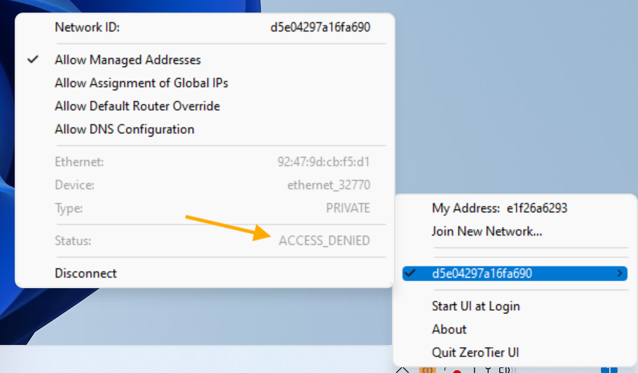

</TabItem>
<TabItem value="mobile">

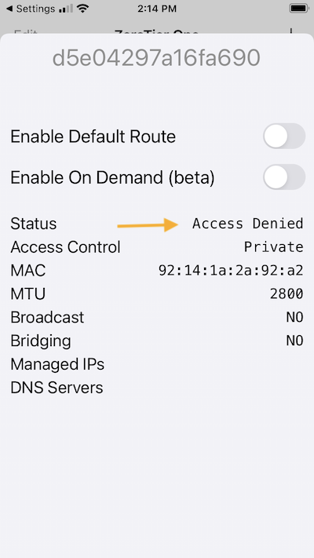

</TabItem>

<TabItem value="linux">

```sh
# zerotier-cli listnetworks
200 listnetworks d5e04297a16fa690  92:61:0e:25:b1:8d ACCESS_DENIED PRIVATE ztijas2mjr -
```

</TabItem>

</Tabs>

### Authorize your device

- Go to the Members panel that we left open on my.zerotier.com
- Your node that just "joined" should appear here.
- The "Address" should match the address in your client.
- Click the "Auth?" check box for it.
- Give it a name. Type something like "laptop" or "bob" into the `(short name)` input.

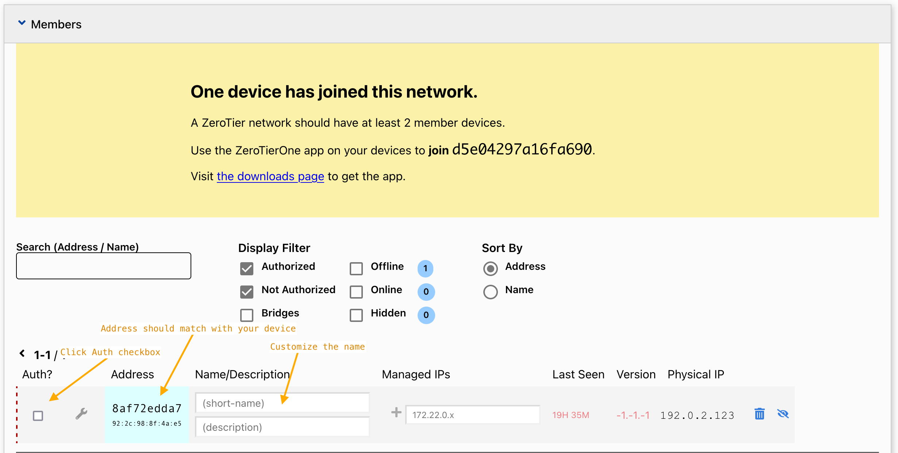

### Confirm authorization

Back on your computer, your client should now say "OK" instead of "ACCESS DENIED" and it should show your custom "my cool network" name.

<Tabs
  defaultValue="mac"
  groupId="access-denied"
  values={[
    { label: "macOS", value: "mac", },
    { label: "Windows", value: "windows", },
    { label: "Linux", value: "linux", },
    { label: "Mobile", value: "mobile", }
  ]}>

<TabItem value="mac">

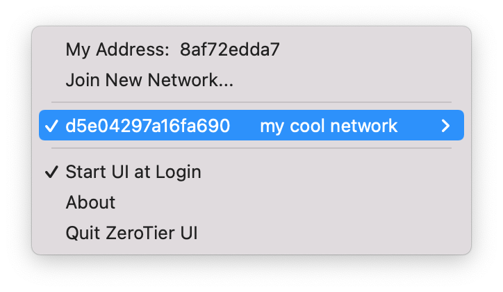
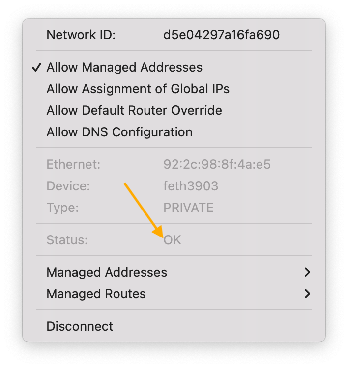

</TabItem>

<TabItem value="windows">

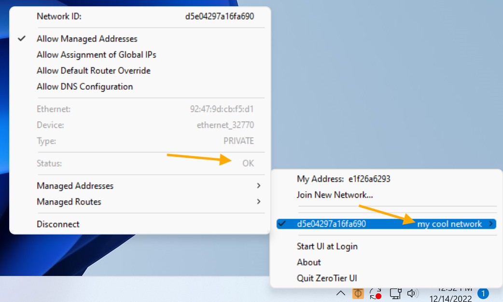

</TabItem>

<TabItem value="linux">

```sh
% zerotier-cli listnetworks
200 listnetworks <nwid> <name> <mac> <status> <type> <dev> <ZT assigned ips>
200 listnetworks d5e04297a16fa690 my cool network 92:2c:98:8f:4a:e5 OK PRIVATE feth3903 172.22.195.59/16```
```

</TabItem>
<TabItem value="mobile">


</TabItem>

</Tabs>

Now you have 1 member on your network. A network with 1 member can't do much.

## Repeat with another device

We need to have 2 devices connected to the same ZeroTier network.

- Repeat the join and authorize steps with your second device.

## Test connectivity

Now you have two authorized nodes on your network. They should be able to talk over ZeroTier.

Your Network Members section should look something like this:


The "Managed IPs" will be different on your network.

We're going to test with `ping`. It's the only program that we can think of that exists by default on every operating system.

This is a command line program, but don't worry: You can do it.

### Gotcha: Windows blocks ping

Windows by default doesn't respond to pings. If you try to ping a Windows computer from a different computer, it won't work. You can enable ping.

<details>
<summary>How to enable ping on Windows</summary>

- Search for Windows Firewall in the Start Menu, and click to open it.
- Click Advanced Settings on the left.
- From the left pane of the resulting window, click Inbound Rules.
- In the right pane, find the rules titled File and Printer Sharing (Echo Request - ICMPv4-In).
- Right-click each rule and choose Enable Rule.

Here is a [tutorial by Microsoft](https://learn.microsoft.com/en-us/windows/security/threat-protection/windows-firewall/create-an-inbound-icmp-rule)

</details>

### Open the command line

- Open the command line on your computer

<Tabs
  defaultValue="mac"
  groupId="ping"
  values={[
    { label: "macOS", value: "mac", },
    { label: "Windows", value: "windows", },
    { label: "Linux", value: "linux", },
    { label: "Mobile", value: "mobile", }
  ]}>

<TabItem value="mac">

- Use Spotlight (cmd-space) to search for Terminal

[Apple's Instructions](https://support.apple.com/guide/terminal/open-or-quit-terminal-apd5265185d-f365-44cb-8b09-71a064a42125/mac)

</TabItem>

<TabItem value="windows">

- Search for "powershell" and open it

[Microsoft's Instructions](https://learn.microsoft.com/en-us/powershell/scripting/windows-powershell/starting-windows-powershell?view=powershell-7.3)

</TabItem>

<TabItem value="linux">

- It's different on every flavor of linux. You'll have to search duckduckgo for "open terminal ubuntu" or similar.

</TabItem>

<TabItem value="mobile">
Mobile operating systems don't have a command line. You can download a "ping" app from your app store if you want.

Or `ping` your phone from your desktop computer.

Try switching your phone from wifi to cell and back. It may take about a minute, but ZeroTier should automatically keep the connection working.

</TabItem>

</Tabs>

### Find the ZeroTier IP Addresses of your devices


### Try the ping command

Back in the Command Line / Terminal that you just opened:

- type `ping -c 5 $ZEROTIER_IP_ADDRESS` `<enter>` into your command line.

A successful `ping`:

```sh
% ping -c 5 172.22.217.93
PING 172.22.217.93 (172.22.217.93): 56 data bytes
64 bytes from 172.22.217.93: icmp_seq=0 ttl=64 time=22.362 ms
64 bytes from 172.22.217.93: icmp_seq=1 ttl=64 time=10.157 ms
64 bytes from 172.22.217.93: icmp_seq=2 ttl=64 time=9.414 ms
64 bytes from 172.22.217.93: icmp_seq=3 ttl=64 time=9.019 ms
64 bytes from 172.22.217.93: icmp_seq=4 ttl=64 time=9.180 ms

--- 172.22.217.93 ping statistics ---
5 packets transmitted, 5 packets received, 0.0% packet loss
round-trip min/avg/max/stddev = 9.019/12.026/22.362/5.182 ms
```

Try it with both ZeroTier Managed addresses on your network.

One of them is the same device you're on, so you're pinging yourself. Pinging the other device might be a little more interesting.

:::info
If something goes wrong you might see something like:

```sh
% ping -c 5 172.22.217.92
PING 172.22.217.92 (172.22.217.92): 56 data bytes
Request timeout for icmp_seq 0
Request timeout for icmp_seq 1
Request timeout for icmp_seq 2
Request timeout for icmp_seq 3

--- 172.22.217.92 ping statistics ---
5 packets transmitted, 0 packets received, 100.0% packet loss
```

or

```sh
ping -c 5 192.168.123.234
PING 192.168.123.234 (192.168.123.234): 56 data bytes
92 bytes from 192.168.82.1: Destination Port Unreachable
Vr HL TOS  Len   ID Flg  off TTL Pro  cks      Src      Dst
 4  5  00 5400 56e7   0 0000  3f  01 d4ad 192.168.82.217  192.168.123.234
```

There may just be a typo in the IP address. Double check that your device is authorized at my.zerotier.com

Contact us on the [discussion forum](https://discuss.zerotier.com/) and see the [troubleshooting section](faq) if you get stuck.
:::

## Conclusion

`ping` doesn't accomplish anything, but it does tell us ZeroTier is working. It's useful to know about for troubleshooting networks, not just ZeroTier networks.

Visit the [discussion forum](https://discuss.zerotier.com/) to talk about your use-cases or if you get stuck.

### Now, use ZeroTier to do something you want to do

### Some popular uses

- Windows Remote Desktop
- ssh (try [mosh](https://mosh.org/))
- Private Gaming LAN
- Access the web interfaces of your home lab
- Build your own [VPN](https://zerotier.atlassian.net/wiki/spaces/SD/pages/7110693/Overriding+Default+Route+Full+Tunnel+Mode)
- Route to a [remote subnet](https://zerotier.atlassian.net/wiki/spaces/SD/pages/224395274/Route+between+ZeroTier+and+Physical+Networks)
- Route to a [Docker network](https://zerotier.atlassian.net/wiki/spaces/SD/pages/7274520/Using+NDP+Emulated+6PLANE+Addressing+With+Docker)
- Add [dns](dns) to your network

### Join multiple networks

A node can join many networks at once. Make sure they don't use the same subnet!

You can have a `home` network, a `friends` network, and a `work` network, for example.

They don't all need to be networks that you've created. You can join other people's networks.

### Check out the Whitepaper

For more info on the cryptography and protocol, see the: [Design Whitepaper](protocol)
